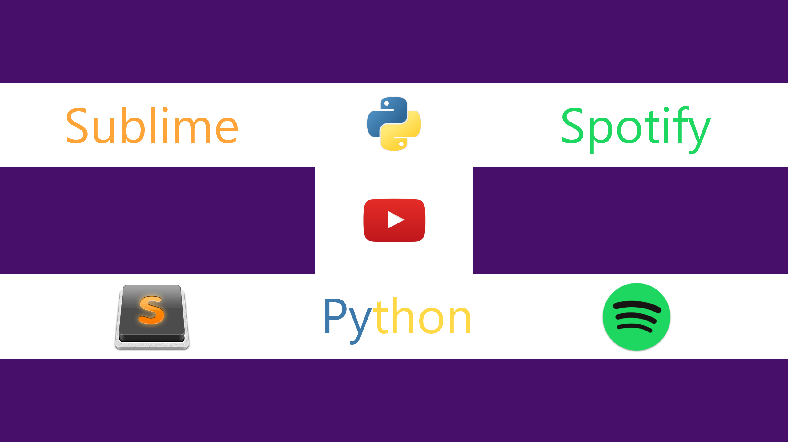

# SpotifyWeb
This plugin connects to your [Spotify](https://www.spotify.com/) account and polls for the current track. It then displays the `track title` in the `status bar` of [Sublime Text](https://www.sublimetext.com/). The song is only displayed if Spotify is not paused/stopped.

It is possible to Enable/Disable the plugin and also change the polling interval.

## Installation
Search for `SpotifyWeb` on [Package Control](https://packagecontrol.io/installation#st3) or clone this repository into `Preferences` :arrow_right:  `Browse Packages`.

Note, that the plugin depends on [spotipy](https://spotipy.readthedocs.io), which in turn depends on [requests](https://github.com/requests/requests). The former is included in this repository, while the later is fetched by [Package Control](https://packagecontrol.io/installation#st3). So even if you download this repository manually you still need to have [Package Control](https://packagecontrol.io/installation#st3) installed to fetch the dependency on [requests](https://github.com/requests/requests).

## Requirements
This plugin has only been tested with Sublime Text 3.

## Why do I have to register my own app?
Extracted from [developer.spotify.com](https://developer.spotify.com/my-applications/#!/applications):
```
Always store keys securely! Regenerate your client secret if you supect it has been compromised!
```
This means that unfortunately every user has to register his/her own app.

## Watch how it was built
[](https://youtu.be/1O-c-4mXqRc?list=PLJGDHERh23x_t5w5U3e_cWg5CLeCq8_7j "Watch on YouTube")
